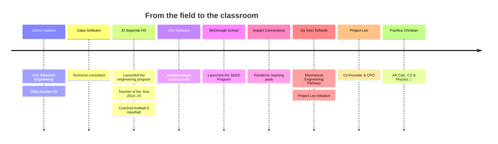

<!-- Header banner: capsule-render (https://github.com/kyechan99/capsule-render) -->


<!-- Typing animation: readme-typing-svg (https://github.com/DenverCoder1/readme-typing-svg) -->
<p align="center">
  <a href="https://github.com/seawolf-seno">
    
  </a>
</p>

<!-- Badges: shields.io (https://shields.io) -->
<p align="center">
  <a href="https://www.pacificachristian.org/about/pacifica-stories/meet-steve-eno-math-teacher"></a>
  <a href="https://www.linkedin.com/in/steve-eno/"></a>
  <a href="https://x.com/steveneno"></a>
  <a href="https://projectleo.substack.com/"></a>
</p>

---

## 🌊 About Me

```js
const mrEno = {
  role: "Teacher @ Pacifica Christian High School",
  teaching: ["AP Calculus", "Computer Science", "Physics"],
  education: "B.S. Electrical Engineering, Johns Hopkins University",
  formerly: "Johns Hopkins wide receiver #5 🏈",
  priorities: ["Faith", "Family", "Teaching", "Adventure", "Health & Joy"],
  family: "Husband + dad of three boys",
  funFact: "Named El Segundo HS Teacher of the Year (2014–15)",
};
```

- 🔭 Currently building ed-tech tools with AI and modern web frameworks
- 🌱 Currently learning: how far AI coding agents can go (and where they still need a human)
- 💬 Ask me about: engineering, project-based learning, mastery-based grading, or the best movie ever made (see below)
- ⚡ Fun fact: I called Johns Hopkins radio broadcasts for home games

> *"If you take time to step back and see the magnificent connections in the universe, life gets much more rich, beautiful, and interesting."*

---

## 🧰 Tools I Teach & Build With

<!-- Skill icons: https://skillicons.dev -->
<p align="center">
  <a href="https://skillicons.dev">
    
  </a>
</p>

---

## 🗺️ My Journey

<!-- GitHub renders Mermaid diagrams natively -->


<details>
<summary><b>🛠️ Things I've Built (click to expand)</b></summary>
<br/>

| Project | What it does |
|---|---|
| 🧠 **Project Leo** | AI-powered classroom platform that personalizes student projects |
| ✅ **Eno Software** | Mastery-based grading tools for the LMU Center for Math & Science Teaching |
| 🌱 **SEED Program** | Social Entrepreneurship, Engineering & Design program at McDonogh School |
| 🏘️ **Impact Connections** | Community learning pods with a mentoring focus |
| 🤖 **El Segundo Engineering** | Built the program from scratch; mentored robotics & cybersecurity teams |

</details>

---

## 🏄 Off the Clock

| 🏂 Snowboarding | 🌊 Surfing | 🚵 Mountain Biking | 🏈 Athletics |
|:---:|:---:|:---:|:---:|
| Winter mode | South Bay vibes | Newest obsession | Once a WR, always a WR |

### 🎬 My Top 5 Movies

1. **3 Idiots** 🎓
2. **Spider-Man: Into the Spider-Verse** 🕷️
3. **Big Hero 6** 🤖
4. **The Sandlot** ⚾
5. **Star Wars: The Empire Strikes Back** 🌌

---

## 📊 GitHub Stats

<!-- github-readme-stats & streak-stats are free public services; if a card doesn't load, the service is rate-limited, not broken -->
<p align="center">
  
  
</p>

<p align="center">
  
</p>

## 🐍 Contribution Snake

<!-- Generated daily by .github/workflows/snake.yml using Platane/snk -->
<p align="center">
  <picture>
    <source media="(prefers-color-scheme: dark)" srcset="https://raw.githubusercontent.com/seawolf-seno/seawolf-seno/output/github-snake-dark.svg" />
    <source media="(prefers-color-scheme: light)" srcset="https://raw.githubusercontent.com/seawolf-seno/seawolf-seno/output/github-snake.svg" />
    
  </picture>
</p>


